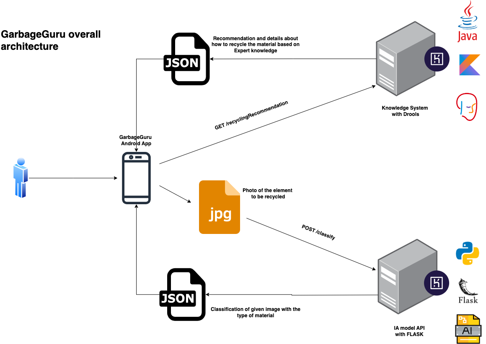

# garbage-guru-api
An API written in Python with Flask for classifying and recycling garbage objects using an AI model. It was created for the Applied AI course in Informatics Engineering - UNLaM 2024. 

The API communicates with the [GarbageGuru Android app](https://github.com/joniaranguri/garbage-guru-android) as outlined in the architecture design:

